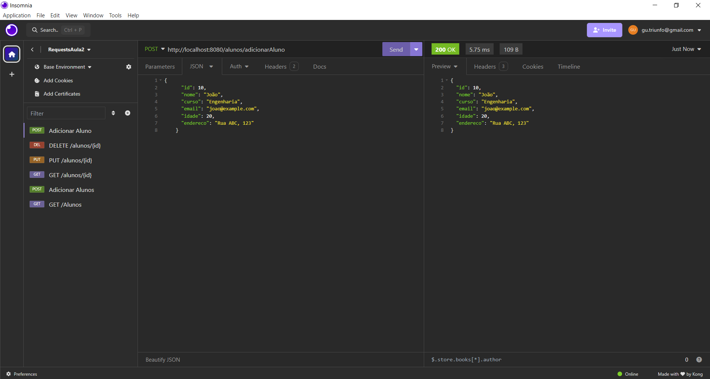
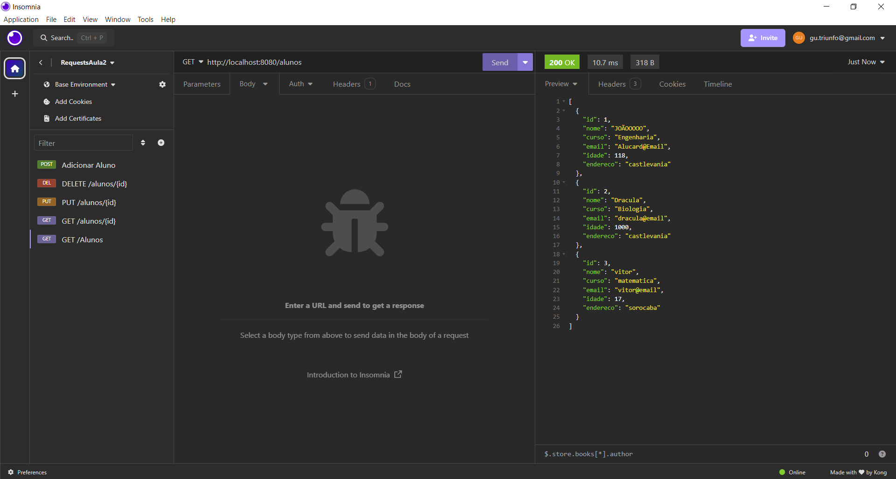
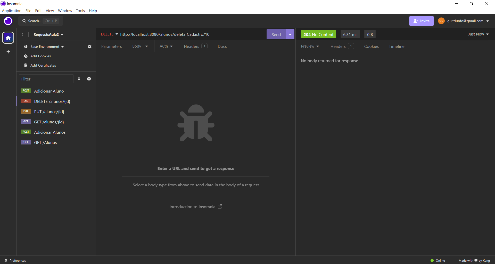
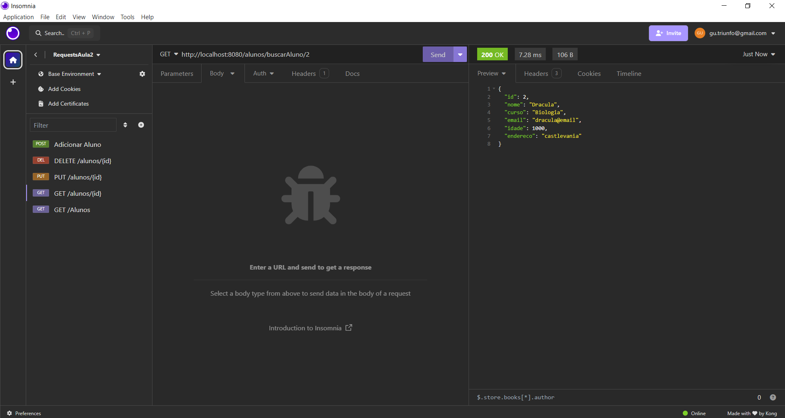

# Arquitetura_Web_2024
## Aula 6 - API usando JPA: Executando no VS Code
Dessa vez o projeto precisou ser alterado para mudar a persistência do postgre para jpa. A estrutura interna foi novamente reformulada conforme podemos verificar no código fonte. Acesse a pasta para visualizar as modificações recentes.

## Exercício da aula 6: Chamada no Insomnia
### POST 

### PUT

### DELETE

### GET

