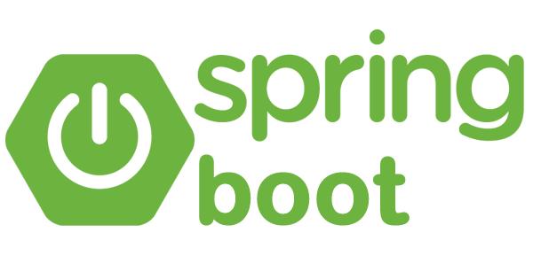

# Arquitetura_Web_2024
# Projeto Desenvolvido "Sistema Faculdade"

Este repositório contém o código-fonte de um projeto desenvolvido utilizando o framework Spring Boot, uma ferramenta poderosa para criar aplicações Java de forma rápida e eficiente.

## Visão Geral

O projeto tem como objetivo criar uma aplicação para gerenciar informações de alunos, incluindo operações CRUD (Create, Read, Update, Delete) para manipulação desses dados por meio de uma API RESTful.

## Estrutura do Projeto

O projeto está estruturado em diferentes camadas:

- **Controller**: Responsável por receber as requisições HTTP e direcioná-las para os serviços apropriados.
- **Service**: Contém a lógica de negócio da aplicação, incluindo operações como adicionar, atualizar, buscar e excluir alunos.
- **Repository**: Responsável pela interação com a fonte de dados (banco de dados ou outro sistema de armazenamento), fornecendo operações de acesso aos dados.

## Tecnologias Utilizadas

- **Spring Boot**: Utilizado como o framework principal para o desenvolvimento da aplicação, fornecendo uma configuração fácil e rápida.
- **Java**: Linguagem de programação principal utilizada no desenvolvimento do projeto.
- **Maven/Gradle**: Gerenciadores de dependências utilizados para gerenciar as bibliotecas e dependências do projeto.

## Progresso Atual

Até o momento, foram implementadas as seguintes funcionalidades:

- Criação, listagem, busca, atualização e exclusão de alunos através da API REST.
- Configuração de injeção de dependência para separação de preocupações e desacoplamento.
- Manipulação de exceções e tratamento de erros para melhorar a robustez da aplicação.

## Próximos Passos

Os próximos passos incluem:

- Implementação de autenticação e autorização para proteger os endpoints da API.
- Implementação de testes automatizados para garantir a qualidade do código.
- Refatoração e otimização do código conforme necessário.

Sinta-se à vontade para explorar o código-fonte e contribuir para o desenvolvimento deste projeto!

## IDE
Esse projeto utiliza a IDE Visual Studio Code como ambiente de desenvolvimento.
Extensões utilizadas:
- Extension Pack for Java
- Spring Boot Extension Pack
  

